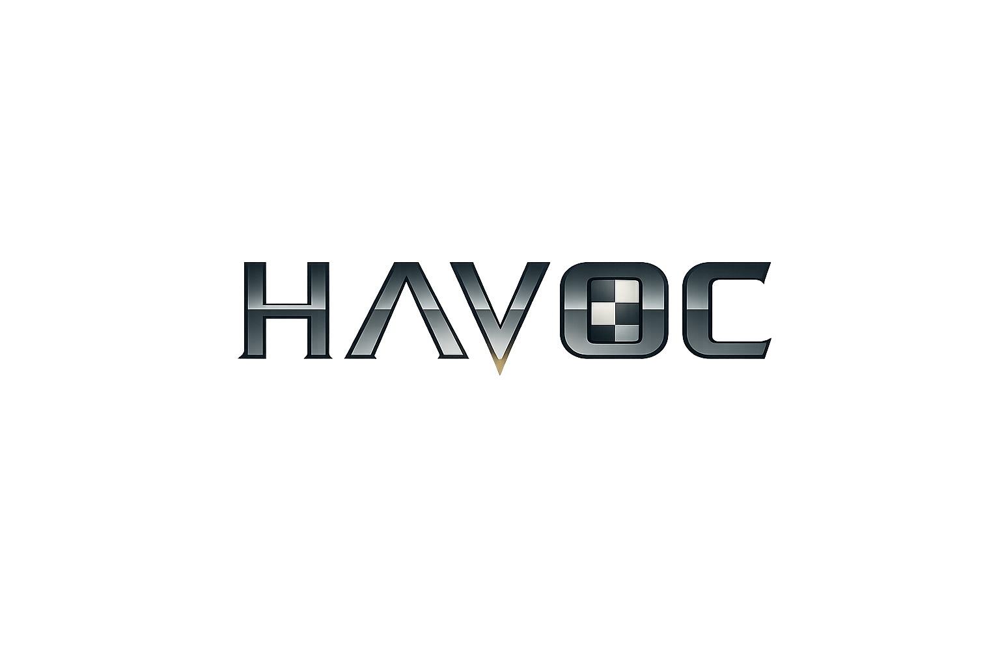

<p align="center">
  
</p>

<p align="center">
  <strong>A modern, multi-threaded UCI chess engine written in C++20</strong>
</p>

<p align="center">
  <a href="https://github.com/mjglatzmaier/chess/actions/workflows/ci.yml">
    
  </a>
  <a href="LICENSE">
    
  </a>
  
  
</p>

---

## Overview

**haVoc** is a UCI-compliant chess engine as a hobby project on and off over the years. It features bitboard-based move generation with magic bitboards, an alpha-beta search with modern pruning techniques, and a hand-crafted evaluation function — all designed with extensibility toward NNUE and GPU-accelerated MCTS in mind.

## Features

### Search
- Alpha-beta with iterative deepening and aspiration windows
- Late move reductions (LMR) with history-aware tuning
- Null move pruning with verification
- Reverse futility pruning (static null move pruning)
- Singular extensions with multi-cut
- Internal iterative reductions (IIR)
- Countermove and history heuristics
- Quiescence search with delta pruning and SEE

### Evaluation
- Hand-crafted evaluation (HCE) with `IEvaluator` interface for future NNUE drop-in
- Material and piece-square tables with tapered middlegame/endgame interpolation
- Pawn structure: doubled, isolated, backward, and passed pawn detection
- King safety: attack counting, pawn shelter, piece coordination
- Mobility, threats, space, and specialized endgame knowledge
- Per-thread pawn and material hash tables

### Infrastructure
- Multi-threaded search via Lazy SMP thread pool
- Transposition table with 4-entry clustering and XOR verification
- Modern C++20: `std::popcount`, `std::countr_zero`, `constexpr`, `[[nodiscard]]`
- Cross-platform: Linux (GCC/Clang), macOS (AppleClang), Windows (MSVC)
- 40+ unit tests including perft validation across 5 standard positions
- Built-in `bench` command for regression testing

## Build

### Prerequisites
- **C++20 compiler**: GCC 12+, Clang 15+, AppleClang 16+, or MSVC 2022+
- **CMake**: 3.20+

### Quick Start
```sh
git clone https://github.com/mjglatzmaier/chess.git
cd chess
cmake -B build -DCMAKE_BUILD_TYPE=Release
cmake --build build --parallel
```

### Run Tests
```sh
ctest --test-dir build --output-on-failure
```

### CMake Options
| Option | Default | Description |
|--------|---------|-------------|
| `HAVOC_ENABLE_TESTS` | `ON` | Build unit tests (requires Google Test, fetched automatically) |
| `HAVOC_ENABLE_BENCH` | `OFF` | Build benchmark targets |
| `HAVOC_ENABLE_SANITIZERS` | `OFF` | Enable ASan/UBSan in Debug builds |
| `HAVOC_NATIVE` | `ON` | Enable `-march=native` for SIMD/popcnt |

## Usage

haVoc communicates via the [Universal Chess Interface (UCI)](https://www.chessprogramming.org/UCI) protocol. Connect it to any UCI-compatible GUI (Arena, Cute Chess, Banksia, etc.) or run it directly:

```
$ ./build/havoc
haVoc v2.0.0
by M.Glatzmaier
```

### UCI Commands
```
uci                          # Engine identification and options
isready                      # Synchronization check
position startpos moves e2e4 # Set up position
go depth 15                  # Search to depth 15
go wtime 60000 btime 60000   # Search with time control
go infinite                  # Search until 'stop'
stop                         # Stop searching
bench 10                     # Run benchmark (depth 10)
quit                         # Exit
```

### Engine Options
```
setoption name Threads value 4     # Number of search threads (default: 1)
setoption name Hash value 256      # Transposition table size in MB (default: 1024)
```

## Roadmap

- [ ] Texel/SPSA parameter tuning for HCE
- [ ] NNUE evaluation (self-play training pipeline)
- [ ] Syzygy endgame tablebase probing
- [ ] Opening book support (Polyglot format)
- [ ] GPU inference hooks for NNUE
- [ ] MCTS search strategy (AlphaZero-style)
- [ ] Chess960 / Fischer Random support

## License

[MIT License](LICENSE)
